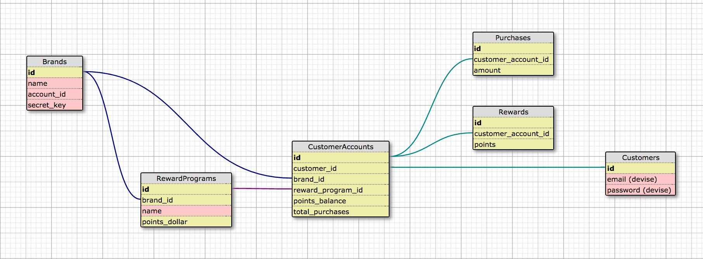

I created a fully functional Rails app that allows customers to:
- enroll in a reward program from one of their accounts
- purchase and earn points
- redeem rewards with their points

It is now deployed at https://my-loyalty-plus.herokuapp.com
1) Login (see users seed data)
2) Select your [Frontier Outdoor Supply] account
3) Enroll
4) Purchase & Redeem

Schema for this app is as follows:

With more time, I would add tests, and consider turning into an API.
